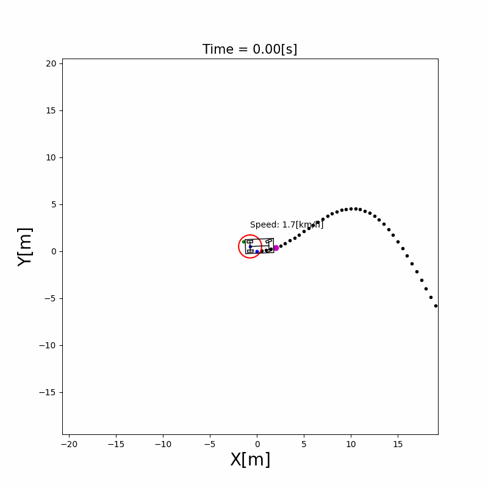
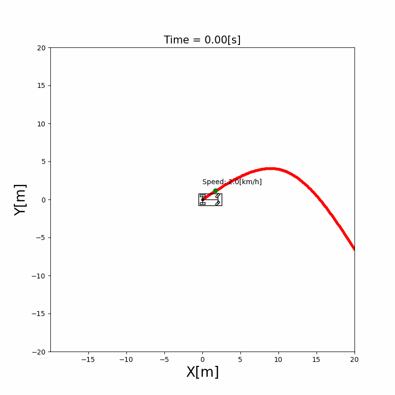
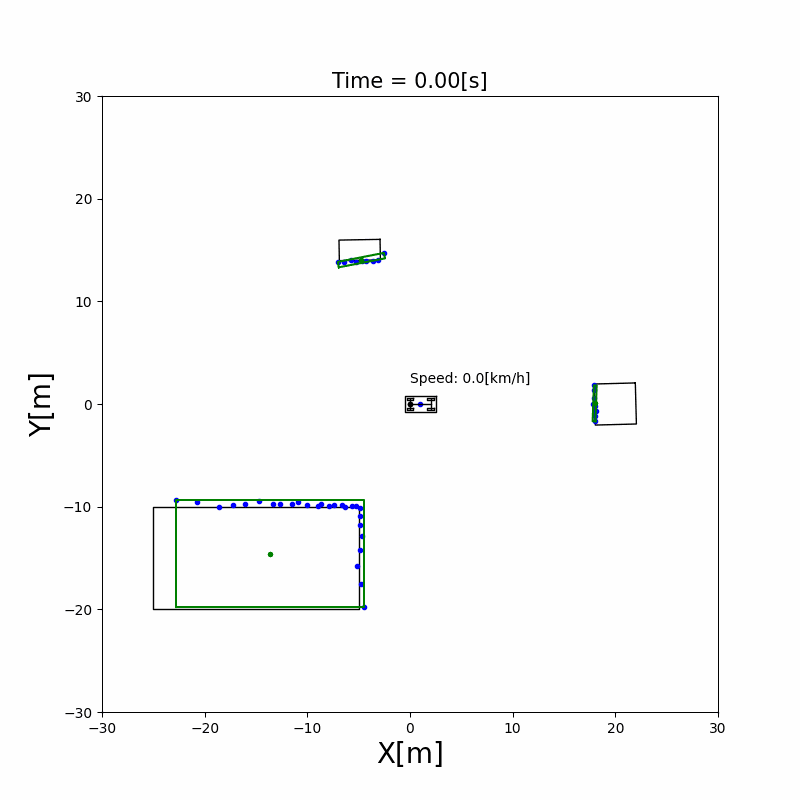

# AutonomousVehicleControlBeginnersGuide
[](https://github.com/ShisatoYano/AutonomousDrivingSamplePrograms/actions/workflows/Linux_CI.yml) [](https://github.com/ShisatoYano/AutonomousDrivingSamplePrograms/actions/workflows/Windows_CI.yml) [](https://github.com/ShisatoYano/AutonomousDrivingSamplePrograms/actions/workflows/MacOS_CI.yml) [](https://www.codefactor.io/repository/github/shisatoyano/autonomousvehiclecontrolbeginnersguide)  

Python sample codes and documents about Autonomous vehicle control algorithm. In the future, I want to release these ones as my own technical book for beginners.  


## Table of Contents
* [What is this?](#what-is-this)
* [Goal of this project](#goal-of-this-project)
* [Requirements](#requirements)
* [How to use](#how-to-use)
* [Examples of Simulation](#examples-of-simulation)
    * [Localization](#localization)
        * [Extended Kalman Filter Localization](#extended-kalman-filter-localization)
    * [Mapping](#mapping)
        * [NDT Map Construction](#ndt-map-construction)
    * [Path Tracking](#path-tracking)
        * [Pure pursuit Path Tracking](#pure-pursuit-path-tracking)
    * [Perception](#perception)
        * [Rectangle fitting Detection](#rectangle-fitting-detection)
        * [Sensor's Extrinsic Parameters Estimation](#sensors-extrinsic-parameters-estimation)
* [License](#license)
* [Use Case](#use-case)


## What is this?
This is a sample codes collections about Autonomous vehicle control algorithm. Each source codes are implemented with Python to help your understanding. You can fork this repository and use for studying, education or work freely.  


## Goal of this project
I want to release my own technical book about Autonomous Vehicle algorithms in the future. The book will include all of codes and documents in this repository as contents.  


## Requirements
For running each sample codes:  
* [Python 3.11.x](https://www.python.org/)
* [Matplotlib](https://matplotlib.org/)
* [NumPy](https://numpy.org/)
* [SciPy](https://scipy.org/)

For development:
* [pytest](https://docs.pytest.org/en/7.4.x/) (for unit tests)
* [pytest-cov](https://github.com/pytest-dev/pytest-cov) (for coverage measurement)

For setting up the environment with Docker:
* [VS Code](https://code.visualstudio.com/)
* [Docker](https://www.docker.com/)
* [WSL](https://learn.microsoft.com/en-us/windows/wsl/)


## How to use
1. Clone this repository  
    ```bash
    $ git clone https://github.com/ShisatoYano/AutonomousVehicleControlBeginnersGuide
    ```

2. Set up the environment for running each codes
    * Set up on your local directory:
        ```bash
        $ pip install .devcontainer/requirements.txt
        ```
    * Set up with Docker on WSL:
        * Before cloning thi repo, [install WSL](https://learn.microsoft.com/en-us/windows/wsl/install) and [Docker](https://docs.docker.com/desktop/install/linux-install/) in advance
        * Clone this repo following the above Step 1
        * Open this repo's folder by VSCode
        * [Create Dev Container](https://code.visualstudio.com/docs/devcontainers/create-dev-container)
        * And then, all required libraries are installed automatically
3. Execute unit tests to confirm the environment were installed successfully
    ```bash
    $ . run_test_suites.sh
    ```
4. Execute a python script at src/simulations directory
    * For example, when you want to execute localization simulation of Extended Kalman Filter:
        ```bash
        $ python src/simulations/localization/extended_kalman_filter_localization/extended_kalman_filter_localization.py
        ```
5. Add star to this repository if you like it!!


## Examples of Simulation
### Localization
#### Extended Kalman Filter Localization
  
### Mapping
#### NDT Map Construction
  
### Path Tracking
#### Pure pursuit Path Tracking
  
### Perception
#### Rectangle fitting Detection
  
#### Sensor's Extrinsic Parameters Estimation
Estimation by Unscented Kalman Filter  
  


## License
MIT  


## Use Case
I started this project to study an algorithm and software development for Autonomous Vehicle system by myself. You can also use this repo for your own studying, education, researching and development.  

If this project helps your task, please let me know by creating a issue.  
Any paper, animation, video as your output, always welcome!! It will encourage me to continue this project.  


## Contribution
Any contribution including an issue,                                                                                                                                                                                                                                        