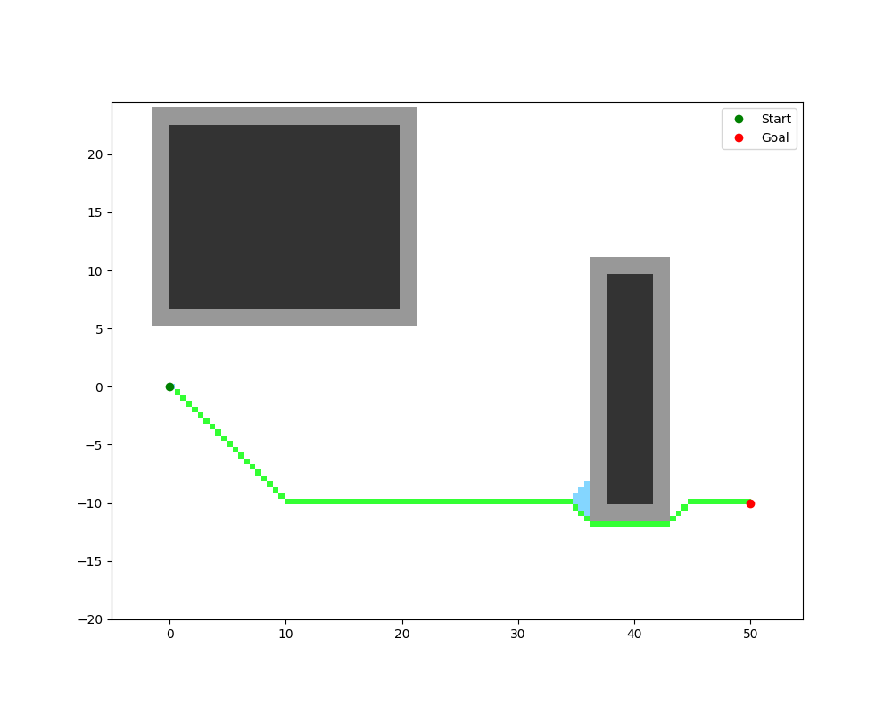
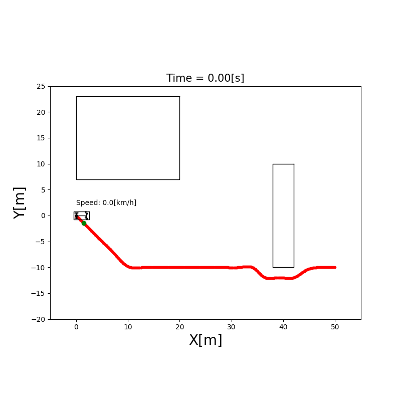
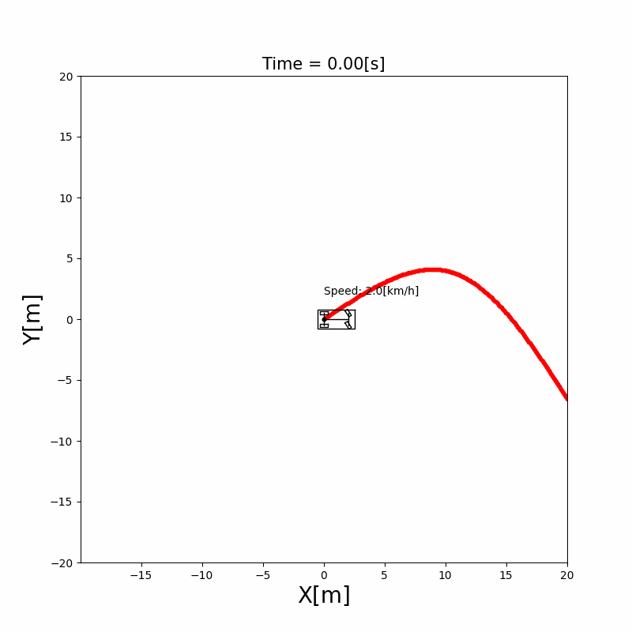

# AutonomousVehicleControlBeginnersGuide
[](https://github.com/ShisatoYano/AutonomousDrivingSamplePrograms/actions/workflows/Linux_CI.yml) [](https://github.com/ShisatoYano/AutonomousDrivingSamplePrograms/actions/workflows/Windows_CI.yml) [](https://github.com/ShisatoYano/AutonomousDrivingSamplePrograms/actions/workflows/MacOS_CI.yml) [](https://www.codefactor.io/repository/github/shisatoyano/autonomousvehiclecontrolbeginnersguide)  

Python sample codes and documents about Autonomous vehicle control algorithm. This project can be used as a technical guide book to study the algorithms and the software architectures for beginners.  

  


## Table of Contents
* [What is this?](#what-is-this)
* [Goal of this project](#goal-of-this-project)
* [Requirements](#requirements)
* [How to use](#how-to-use)
* [Examples of Simulation](#examples-of-simulation)
    * [Localization](#localization)
        * [Extended Kalman Filter Localization](#extended-kalman-filter-localization)
        * [Unscented Kalman Filter Localization](#unscented-kalman-filter-localization)
        * [Particle Filter Localization](#particle-filter-localization)
    * [Mapping](#mapping)
        * [Binary Occupancy Grid Map Construction](#binary-occupancy-grid-map-construction)
        * [Cost Map Construction](#cost-map-construction)
        * [NDT Map Construction](#ndt-map-construction)
    * [Path Planning](#path-planning)
        * [A*](#a)
        * [Bidirectional A*](#bidirectional-a)
        * [Hybrid A*](#hybrid-a)
        * [Dijkstra](#dijkstra)
        * [RRT](#rrt)
    * [Path Tracking](#path-tracking)
        * [Pure pursuit Path Tracking](#pure-pursuit-path-tracking)
        * [Rear wheel feedback Path Tracking](#rear-wheel-feedback-path-tracking)
        * [LQR(Linear Quadratic Regulator) Path Tracking](#lqrlinear-quadratic-regulator-path-tracking)
        * [Stanley steering control Path tracking](#stanley-steering-control-path-tracking)
    * [Perception](#perception)
        * [Rectangle fitting Detection](#rectangle-fitting-detection)
        * [Sensor's Extrinsic Parameters Estimation](#sensors-extrinsic-parameters-estimation)
* [Documents](#documents)
* [License](#license)
* [Use Case](#use-case)
* [Contribution](#contribution)
* [Author](#author)


## What is this?
This is a sample codes collections about Autonomous vehicle control algorithm. Each source codes are implemented with Python to help your understanding. You can fork this repository and use for studying, education or work freely.  


## Goal of this project
I want to release my own technical book about Autonomous Vehicle algorithms in the future. The book will include all of codes and documents in this repository as contents.  


## Requirements
Please satisfy with the following requirements on native or VM Linux in advance.  
For running each sample codes:  
* [Python 3.13.x](https://www.python.org/)
* [Matplotlib](https://matplotlib.org/)
* [NumPy](https://numpy.org/)
* [SciPy](https://scipy.org/)

For development:
* [pytest](https://docs.pytest.org/en/7.4.x/) (for unit tests)
* [pytest-cov](https://github.com/pytest-dev/pytest-cov) (for coverage measurement)

For setting up the environment with Docker:
* [VS Code](https://code.visualstudio.com/)
* [Docker](https://www.docker.com/)


## How to use
1. Clone this repository  
    ```bash
    $ git clone https://github.com/ShisatoYano/AutonomousVehicleControlBeginnersGuide
    ```

2. Set up the environment for running each codes
    * Set up with Docker on WSL:
        * Before cloning thi repo, [install Docker](https://docs.docker.com/desktop/install/linux-install/) in advance
        * Clone this repo following the above Step 1
        * Open this repo's folder by VSCode
        * [Create Dev Container](https://code.visualstudio.com/docs/devcontainers/create-dev-container)
        * And then, all required libraries are installed automatically
3. Execute unit tests to confirm the environment were installed successfully
    ```bash
    $ . run_test_suites.sh
    ```
4. Execute a python script at src/simulations directory
    * For example, when you want to execute localization simulation of Extended Kalman Filter:
        ```bash
        $ python src/simulations/localization/extended_kalman_filter_localization/extended_kalman_filter_localization.py
        ```
5. Add star to this repository if you like it!!


## Examples of Simulation
### Localization
#### Extended Kalman Filter Localization
  
#### Unscented Kalman Filter Localization
  
#### Particle Filter Localization
  
#### EKF(Blue) vs UKF(Cyan) vs PF(Lime)
    
### Mapping
#### Binary Occupancy Grid Map Construction
  
#### Cost Map Construction
  
#### NDT Map Construction
  
### Path Planning
#### A*
Planning  
  
Navigation  
  
#### Bidirectional A*
Planning  
  
Navigation  
  
#### Hybrid A*
Planning  
  
Navigation  
  
#### Dijkstra
Planning(Reduce frames by sampling every nth node to prevent memory exhaustion)  
  
Navigation  
  
#### RRT
Planning  
  
Navigation  
  
### Path Tracking
#### Pure pursuit Path Tracking
  
#### Rear wheel feedback Path Tracking
  
#### LQR(Linear Quadratic Regulator) Path Tracking
  
#### Stanley steering control Path Tracking
  
### Perception
#### Rectangle fitting Detection
  
#### Sensor's Extrinsic Parameters Estimation
Estimation by Unscented Kalman Filter  
  


## Documents
Design documents of each Python programs are prepared here. The documents are still not completed. They have been being updated. If you found any problems in them, please tell me by creating an issue.  
[Documents link](/doc/DESIGN_DOCUMENT.md)  


## License
MIT  


## Use Case
I started this project to study an algorithm and software development for Autonomous Vehicle system by myself. You can also use this repo for your own studying, education, researching and development.  

If this project helps your task, please let me know by creating a issue.  
Any paper, animation, video as your output, always welcome!! It will encourage me to continue this project.  

Your comment and output is added to [this list of user comments](/USERS_COMMENTS.md).  


## Contribution
Any contribution by creating an issue or sending a pull request is welcome!! Please check [this document about how to contribute](/HOWTOCONTRIBUTE.md).  


## Author
[Shisato Yano](https://github.com/ShisatoYano)  
