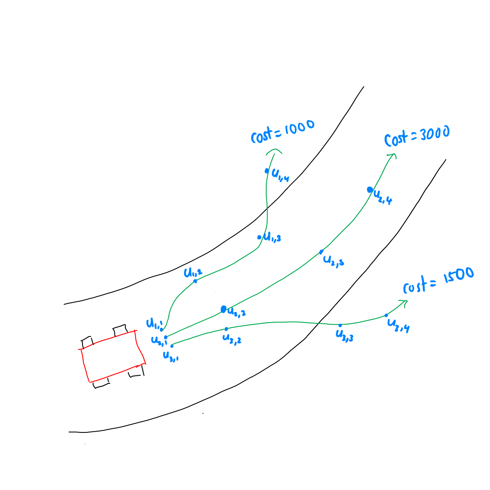

# 6. MPPI Controller

In this chapter, the MPPI (Model Predictive Path Integral) path tracking controller class is implemented. This class implements the MPPI path tracking algorithm, which computes a steering angle and acceleration command by **sampling thousands of random control sequences**, rolling each one forward through the vehicle dynamics, scoring them by cost, and computing a weighted average update.

Before getting into the code, let's get some basic understanding behind the algorithm:

### **Model Predictive Path Integral (MPPI)**

- Introduced by Williams et al. (2017) at Georgia Tech.
- Belongs to the family of **stochastic optimal control** methods.
- Instead of solving an optimization problem algebraically (like MPC), MPPI samples K random perturbations around a nominal control sequence, simulates each one, and combines them using **information-theoretic weighting**.

The key idea is: run $K$ imagined futures in parallel, score each by how well it tracks the path, then take a weighted combination - low-cost futures get high weight, high-cost futures get low weight.

1. **Sampling** - draw K random noise sequences from a Gaussian distribution
2. **Rollout** - simulate the vehicle forward T steps for each sample
3. **Weighting** - assign higher weight to samples with lower trajectory cost
4. **Update** - shift the nominal control sequence toward the best samples

<p align="center">
  
</p>

Ref: https://dilithjay.com/blog/mppi

**Advantages over MPC:**

- No solver required - the update is a simple weighted sum.
- Naturally parallelisable over K - runs efficiently on a GPU.
- Handles **non-convex, non-smooth** cost landscapes where gradient-based solvers struggle.
- Global exploration through stochastic sampling - can escape local minima.

**Disadvantages:**

- Constraints are **soft only** - satisfied by increasing cost, never hard-blocked (like MPC where hard constraints are enforced).
- Solution quality depends on K - more samples give a better approximation but cost more compute.
- Tuning parameters ($\lambda$, $K$, $\sigma$) requires experimentation with no systematic design method.
- Can be noisy at low K values, producing jittery control.

---

## 6.1 MppiController Class

The controller class is located at:
[mppi_controller.py](/src/components/control/mppi/mppi_controller.py)

```python
"""
mppi_controller.py

Author: Shisato Yano
"""

import math, sys
from pathlib import Path
from math import atan2, cos, sin, tan
import numpy as np

from state import State


class MppiController:
    """
    MPPI path-tracking controller aligned with standard formulation:
    warm start (u_prev), exploitation/exploration sampling, stage + terminal cost,
    control cost term (param_gamma * u.T @ inv(Sigma) @ v), and optional smoothing.
    """
```

This class imports trigonometric functions from Python's `math` module and `numpy` for vectorised sampling and matrix operations. It also imports the `State` class to use its `motion_model` static method for simulating the vehicle forward during each sample rollout.

---

### 6.1.1 `_StateView` Helper Class

```python
class _StateView:
    """Minimal state-like object for course methods (x, y, yaw, speed)."""

    def __init__(self, x_m, y_m, yaw_rad, speed_mps):
        self.x_m = x_m
        self.y_m = y_m
        ...

    def get_x_m(self):   return self.x_m
    def get_y_m(self):   return self.y_m
    def get_yaw_rad(self): return self.yaw_rad
    def get_speed_mps(self): return self.speed_mps
```

`_StateView` is a lightweight internal adapter class. The course object's `search_nearest_point_index()` method expects an object with four getter methods - `get_x_m()`, `get_y_m()`, `get_yaw_rad()`, and `get_speed_mps()` - matching the interface of the real `State` class.

During rollouts, the simulated position of each sample is a plain numpy array, not a `State` object. `_StateView` wraps any `(x, y, yaw, speed)` tuple into the interface the course expects, without allocating a full `State` object. It is not a public class and is only used internally by `_get_nearest_waypoint()`.

---

### 6.1.2 Constructor

```python
def __init__(self, spec, course=None, color="g",
             delta_t=0.05, horizon_step_T=20,
             number_of_samples_K=256,
             param_exploration=0.0,
             param_lambda=50.0, param_alpha=1.0,
             sigma_steer=0.1, sigma_accel=0.5,
             max_steer_abs=0.523, max_accel_abs=2.0,
             stage_cost_weight=None,
             terminal_cost_weight=None,
             moving_average_window=0,
             visualize_optimal_traj=True,
             visualize_sampled_trajs=True):

    self.WHEEL_BASE_M         = spec.wheel_base_m
    self.T                    = horizon_step_T
    self.K                    = number_of_samples_K
    self.param_lambda         = max(1e-6, param_lambda)
    self.param_gamma          = param_lambda * (1.0 - param_alpha)
    self.Sigma                = np.array([[sigma_steer**2, 0.0],
                                          [0.0, sigma_accel**2]])
    self.stage_cost_weight    = np.asarray(stage_cost_weight
                                           or [50.0, 50.0, 1.0, 20.0])
    self.terminal_cost_weight = np.asarray(terminal_cost_weight
                                           or self.stage_cost_weight.copy())
    self.u_prev               = np.zeros((self.T, 2))
```

The constructor takes a `VehicleSpecification` object and an optional `CubicSplineCourse`. The key member variables are:

| Variable | Default | Description |
|---|---|---|
| `WHEEL_BASE_M` | from spec | Distance between front and rear axles [m] |
| `T` | 20 | Prediction horizon - number of steps rolled out per sample |
| `K` | 256 | Number of sample trajectories drawn each step |
| `param_lambda` | 50.0 | Temperature $\lambda$ - controls sharpness of weighting |
| `param_gamma` | $\lambda(1-\alpha)$ | Control cost scaling; default $\alpha=1.0 \Rightarrow \gamma=0$ (cost term off) |
| `Sigma` | $\text{diag}(\sigma_\delta^2, \sigma_a^2)$ | Noise covariance matrix for sampling |
| `stage_cost_weight` | [50, 50, 1, 20] | $[w_x, w_y, w_\psi, w_v]$ - stage tracking weights |
| `terminal_cost_weight` | same as stage | $[w_x, w_y, w_\psi, w_v]$ - terminal tracking weights |
| `u_prev` | zeros (T, 2) | Warm-start control sequence `[steer, accel]` per step |
| `target_accel_mps2` | 0.0 | Computed acceleration command [m/s²] |
| `target_steer_rad` | 0.0 | Computed steering angle command [rad] |
| `target_yaw_rate_rps` | 0.0 | Computed yaw rate command [rad/s] |
| `target_speed_mps` | 0.0 | Current speed echoed back (not a planned target - see §6.4.1) |

> **Note on `param_gamma`**: With the default `param_alpha = 1.0`, `param_gamma = 0` and the control cost term in the trajectory cost vanishes entirely. This means the default configuration is pure tracking with no penalty for deviating from the warm-start control. Set `param_alpha < 1.0` only when you want to discourage large perturbations from the previous solution.

---

## 6.2 Algorithm Background

### 6.2.1 State and Control Vectors

MPPI operates on a state vector $x_t$ and control vector $u_t$:

$$
x_t = \begin{bmatrix} x \\ y \\ \psi \\ v \end{bmatrix}
\qquad \text{(position [m], heading [rad], speed [m/s])}
$$

$$
u_t = \begin{bmatrix} \delta \\ a \end{bmatrix}
\qquad \text{(steering angle [rad], acceleration [m/s²])}
$$

The **nominal control sequence** (warm-started from the previous control cycle) is stored as:

$$
U = \{u_{\text{prev}}[0],\; u_{\text{prev}}[1],\; \ldots,\; u_{\text{prev}}[T-1] \} \quad \text{shape: } (T,\,2)
$$

---

### 6.2.2 Sampling - Exploitation and Exploration

At each step, K noise sequences are drawn from a zero-mean Gaussian:

$$
\varepsilon_{k,t} \;\sim\; \mathcal{N}(0, \Sigma) \qquad k = 1\ldots K,\quad t = 0\ldots T-1
$$

$$
\Sigma = \mathrm{diag}(\sigma_{\mathrm{steer}}^2,\; \sigma_{\mathrm{accel}}^2)
\qquad \text{(steer and accel noise are independent)}
$$

The K samples are split into two groups:

```
Exploitation samples  (first (1 − param_exploration) × K):
    v_{k,t}  =  clip( u_prev[t]  +  ε_{k,t} )    <- perturb warm start

Exploration samples   (last  param_exploration × K):
    v_{k,t}  =  clip( ε_{k,t} )                  <- pure random, ignores warm start
```

The exploitation samples refine the previous solution. The exploration samples venture further afield and can discover better solutions when the warm start has drifted off-course. The `param_exploration` parameter controls the ratio.

> **Important**: `v[k,t]` stores the **clipped** perturbed control used for rollout. The raw unclipped noise `epsilon[k,t]` is stored separately. The weighted update later uses `epsilon`, not `v` - this asymmetry is intentional and explained in section 6.2.5.

---

### 6.2.3 Trajectory Cost S(k)

Each sample trajectory $k$ accumulates cost across all T steps plus a terminal cost:

$$
S(k) = \sum_{t=0}^{T-1} \left[ c(x_t^k) \;+\; \gamma \cdot u_{\text{prev}}[t]^\top \Sigma^{-1} v_{k,t} \right] \;+\; \phi(x_T^k)
$$

**Stage tracking cost** $c(x)$ - deviation from the reference path:

$$
c(x) = w_x(x - x_r)^2 + w_y(y - y_r)^2 + w_\psi\,\mathrm{atan2}(\sin(\psi - \psi_r), \cos(\psi - \psi_r))^2 + w_v(v - v_r)^2
$$

The heading error uses `atan2(sin(·), cos(·))` - it wraps the angle difference into $(-\pi, \pi]$ and avoids discontinuities near $\pm\pi$.

**Control cost term** $\gamma \cdot u_{\text{prev}}[t]^\top \Sigma^{-1} v_{k,t}$ - penalises samples that deviate far from the warm-start control. The parameter $\gamma = \lambda(1 - \alpha)$ controls its strength:

```
param_alpha = 1.0  ->  γ = 0   (control cost off - pure tracking, default)
param_alpha = 0.0  ->  γ = λ   (full control cost - conservative)
```

**Terminal cost** $\phi(x_T^k)$ - same structure as $c(x)$ but evaluated only at the last rollout step, using `terminal_cost_weight` instead of `stage_cost_weight`.

---

### 6.2.4 Information-Theoretic Weighting

Once all K trajectory costs are computed, the weights are calculated in three steps:

**Step 1** - Subtract the minimum cost for numerical stability (prevents `exp` overflow):

$$\rho = \min_k S(k)$$

**Step 2** - Compute unnormalised softmin weights:

$$
\tilde{\eta}_k = \exp(-\frac{S(k)-\rho}{\lambda})
$$

**Step 3** - Normalise so weights sum to 1:

$$\eta = \sum_k \tilde{\eta}_k \qquad w_k = \frac{\tilde{\eta}_k}{\eta}$$

The subtraction of $\rho$ before the exponential is a **numerical stability trick** - not a mathematical change. Without it, $\exp(-S/\lambda)$ would underflow to $0$ for all samples when $S$ values are large, making all weights undefined. Subtracting $\rho$ ensures the best sample always contributes $\exp(0) = 1.0$ to the numerator.

---

### 6.2.5 Control Update - Why `epsilon` Not `v`

The weighted perturbation sum is computed using the **raw unclipped noise** `epsilon`, not the clipped `v`:

$$
w_\varepsilon[t] = \sum_k w_k \cdot \varepsilon_{k,t} \qquad \text{shape: } (T, 2)
$$

**Why `epsilon` and not `v`?** 
If the weighted average used the clipped `v[k,t]` instead of the raw `epsilon[k,t]`, the clipping would introduce a systematic bias. Samples that hit the steering or acceleration limit would all contribute the same clipped value regardless of how far outside the limit their original noise was - pulling the update asymmetrically toward the constraint boundary. Using the raw `epsilon` means the weighting reflects the true stochastic intent of each sample without distortion from the clipping operation.

**Optional smoothing** - a moving-average filter can be applied to $w_\varepsilon$ along the time axis:

$$w_\varepsilon \;\leftarrow\; \mathrm{MovingAverage}(w_\varepsilon,\; \text{window})$$

This reduces chatter in the control sequence at the cost of slightly slower response.

**Final update and warm-start shift:**

```
u  =  clip( u_prev  +  w_ε )      <- updated control sequence

apply u[0] → steer0, accel0       <- first action executed this step

warm-start shift for next step:
    u_prev[0..T-2]  ←  u[1..T-1]  <- shift sequence forward by one
    u_prev[T-1]     ←  u[T-1]     <- hold last action (not zero)
```

The last element is **repeated rather than zeroed** because zeroing would force a sudden discontinuity in the control sequence at the horizon boundary - the vehicle would plan to abruptly stop accelerating or steering at step T. Holding the last value is a smoother and more conservative assumption about what happens beyond the horizon.

---

## 6.3 Private Methods

### 6.3.1 `_get_nearest_waypoint(x, y, update_prev_idx)`

```python
def _get_nearest_waypoint(self, x, y, update_prev_idx=False):
    view = _StateView(x, y, 0.0, 0.0)
    nearest_idx = self.course.search_nearest_point_index(view)
    ref_x   = self.course.point_x_m(nearest_idx)
    ref_y   = self.course.point_y_m(nearest_idx)
    ref_yaw = self.course.point_yaw_rad(nearest_idx)
    ref_v   = self.course.point_speed_mps(nearest_idx)
    if update_prev_idx:
        self.prev_waypoints_idx = nearest_idx
    return ref_x, ref_y, ref_yaw, ref_v
```

This method queries the course for the nearest point to `(x, y)` using a global nearest-neighbour search over all course points. The `_StateView(x, y, 0.0, 0.0)` wrapper is required because `search_nearest_point_index()` expects an object with getter methods, not a plain tuple.

It is called in two distinct contexts:

- **Once per `update()` step** on the vehicle's actual position with `update_prev_idx=True` - anchors the stored index.
- **K × T times during rollouts** on the simulated position of each sample - uses a fresh global search each time.

> **Computational note**: Each call to `_get_nearest_waypoint()` performs a full O(N) scan over all N course points. With K=256 samples and T=20 steps, this method is called **5120 times per `update()` step**. On a course with N=500 points, that is 2.56 million distance comparisons per control cycle. This is the primary reason MPPI is slower than expected on CPU and why GPU batching (vectorising the rollout across K) reduces compute from O(K×T×N) sequential calls to a single matrix operation.

---

### 6.3.2 `_g(v)` - Control Clipping

```python
def _g(self, v):
    steer = np.clip(v[0], -self.max_steer_abs, self.max_steer_abs)
    accel = np.clip(v[1], -self.max_accel_abs, self.max_accel_abs)
    return np.array([steer, accel])
```

After adding noise to the warm-start control, `_g()` clips the result to the physical limits of the vehicle. This is MPPI's only mechanism for enforcing control bounds - there are no hard constraints as in MPC. Samples that would require $|\delta| > \delta_{\max}$ are simply clipped to the limit before being rolled out.

The clipped result is stored in `v[k,t]`. Critically, the raw unclipped noise `epsilon[k,t]` is preserved separately and is used in the weighted update - see section 6.2.6 for why this separation matters.

---

### 6.3.3 `_F(x_t, v_t)` - One-Step Dynamics Rollout

```python
def _F(self, x_t, v_t):
    x, y, yaw, v = x_t[0,0], x_t[1,0], x_t[2,0], x_t[3,0]
    steer, accel = float(v_t[0]), float(v_t[1])
    if abs(v) < 1e-9:
        yaw_rate = 0.0
    else:
        yaw_rate = v / self.WHEEL_BASE_M * tan(steer)
    state_vec = np.array([[x], [y], [yaw], [v]])
    input_vec = np.array([[accel], [yaw_rate]])
    return State.motion_model(state_vec, input_vec, self.delta_t)
```

This method advances the vehicle state by one time step $\Delta t$ using the kinematic bicycle model. It exists as a bridge layer because `State.motion_model` takes `(accel, yaw_rate)` as its input, but MPPI works in `(steer, accel)` space. `_F` performs the conversion:

$$\dot{\psi} = \frac{v}{L} \tan(\delta)$$

> A guard against near-zero speed ($|v| < 10^{-9}$) prevents division by zero.

This function is called $K \times T$ times per `update()` step - once for each sample at each horizon step - making it the **computational hotspot** of the algorithm alongside `_c()`.

---

### 6.3.4 `_c(x_t)` - Stage Cost

```python
def _c(self, x_t):
    x, y, yaw, v = float(x_t[0,0]), float(x_t[1,0]), float(x_t[2,0]), float(x_t[3,0])
    yaw = (yaw + 2.0 * np.pi) % (2.0 * np.pi)
    ref_x, ref_y, ref_yaw, ref_v = self._get_nearest_waypoint(x, y)
    ref_yaw = (ref_yaw + 2.0 * np.pi) % (2.0 * np.pi)
    yaw_diff = np.arctan2(np.sin(yaw - ref_yaw), np.cos(yaw - ref_yaw))
    cost = (  stage_cost_weight[0] * (x - ref_x)**2
            + stage_cost_weight[1] * (y - ref_y)**2
            + stage_cost_weight[2] * yaw_diff**2
            + stage_cost_weight[3] * (v - ref_v)**2  )
    return cost
```

The stage cost measures how far the **simulated** state $x_t^k$ deviates from the nearest reference point on the course. It is evaluated at every step of every rollout.

**Two-step yaw normalisation**: the yaw is first mapped to $[0, 2\pi)$ using `% (2π)`, and then `atan2(sin(·), cos(·))` maps the difference back to $(-\pi, \pi]$. The two steps serve different purposes:

1. `% (2π)` - makes both `yaw` and `ref_yaw` positive before subtraction, preventing a sign mismatch from wrap-around (e.g. vehicle at 350° and reference at 10° giving a −340° difference instead of +20°).
2. `atan2(sin(·), cos(·))` - maps the already-consistent difference to the shortest angular path in $(-\pi, \pi]$.

Without the first step, vehicles near $\pm\pi$ can receive arbitrarily large heading errors from a simple sign difference.

---

### 6.3.5 `_phi(x_T)` - Terminal Cost

```python
def _phi(self, x_T):
    # Same structure as _c(), uses terminal_cost_weight
    cost = (  terminal_cost_weight[0] * (x - ref_x)**2
            + terminal_cost_weight[1] * (y - ref_y)**2
            + terminal_cost_weight[2] * yaw_diff**2
            + terminal_cost_weight[3] * (v - ref_v)**2  )
    return cost
```

The terminal cost is evaluated only at the **last state** $x_T^k$ of each sample rollout. It uses `terminal_cost_weight` instead of `stage_cost_weight`. By default the weights are the same, but setting the terminal weights higher encourages samples to end up in a good state at the end of the horizon - analogous to the terminal cost in MPC.

---

### 6.3.6 `_calc_epsilon()`

```python
def _calc_epsilon(self):
    mu = np.zeros(2)
    epsilon = np.random.multivariate_normal(mu, self.Sigma, (self.K, self.T))
    return epsilon
```

Samples the entire noise matrix $\varepsilon \in \mathbb{R}^{K \times T \times 2}$ in a single vectorised call. The shape $(K, T, 2)$ means: K samples, each of T steps, each with 2-dimensional noise $[\varepsilon_{\mathrm{steer}},\, \varepsilon_{\mathrm{accel}}]$.

The covariance matrix is:

$$
\Sigma = \mathrm{diag}(\sigma_{\mathrm{steer}}^2,\; \sigma_{\mathrm{accel}}^2) = \begin{bmatrix} \sigma_{\mathrm{steer}}^2 & 0 \\ 0 & \sigma_{\mathrm{accel}}^2 \end{bmatrix}
$$

The off-diagonal zeros mean steering and acceleration noise are drawn independently. A single `multivariate_normal` call is used rather than two separate `normal` calls to stay consistent with the MPPI formulation, which always refers to a single noise vector $\varepsilon_t \in \mathbb{R}^2$.

---

### 6.3.7 `_compute_weights(S)`

```python
def _compute_weights(self, S):
    rho = S.min()
    eta = np.sum(np.exp((-1.0 / self.param_lambda) * (S - rho)))
    w   = (1.0 / eta) * np.exp((-1.0 / self.param_lambda) * (S - rho))
    return w
```

Implements the information-theoretic weighting formula in three lines. The subtraction of $\rho = \min(S)$ before the exponential is a **numerical stability trick**, not a mathematical change. Without it, $\exp(-S/\lambda)$ would underflow to 0 for all samples when $S$ values are large, making all weights undefined. Subtracting $\rho$ ensures the best sample always contributes $\exp(0) = 1.0$ to the numerator.

The output $w$ is a $(K,)$ array that sums to 1.0, acting as a proper probability distribution over the K samples. These weights are also stored as `self.weights = w.tolist()` for use by `draw()` to scale each sampled trajectory's transparency.

---

### 6.3.8 `_moving_average_filter(xx, window_size)`

```python
def _moving_average_filter(self, xx, window_size):
    b = np.ones(window_size) / window_size
    xx_mean = np.zeros_like(xx)
    for d in range(xx.shape[1]):
        xx_mean[:, d] = np.convolve(xx[:, d], b, mode="same")
        n_conv = math.ceil(window_size / 2)
        xx_mean[0, d] *= window_size / n_conv
        for i in range(1, n_conv):
            xx_mean[i, d]  *= window_size / (i + n_conv)
            xx_mean[-i, d] *= window_size / (i + n_conv - (window_size % 2))
    return xx_mean
```

Applies a moving-average filter to each column of the $(T, 2)$ weighted perturbation array $w_\varepsilon$. The filter smooths the control sequence along the time dimension, reducing high-frequency chatter.

**Edge correction**: `numpy`'s `mode="same"` pads the signal with zeros at the boundaries. For a window of size $W$, the first element is computed from only $\lceil W/2 \rceil$ real values instead of $W$, so `numpy` effectively divides by $W$ when only $\lceil W/2 \rceil$ values exist  under-weighting the edges. The correction loop rescales each boundary element back up by $W / actual\_count$. The `window_size % 2` term handles the asymmetry between even and odd window sizes, where the left and right boundary element counts differ by one.

---

## 6.4 Public Methods

### 6.4.1 `update`

```python
def update(self, state, time_s):
    if not self.course:
        self.target_accel_mps2   = 0.0
        self.target_yaw_rate_rps = 0.0
        self.target_steer_rad    = 0.0
        self.target_speed_mps    = state.get_speed_mps()
        self.optimal_trajectory  = None
        self.sampled_trajectories = []
        self.weights             = []
        return
```

If no course is set, the method returns early and resets all outputs to safe defaults: acceleration and steering to zero, trajectories to empty lists, and weights to an empty list. Callers that inspect `self.weights` or `self.sampled_trajectories` after a no-course call will receive empty containers, not stale values from the previous step.

```python
    x0 = np.array([[state.get_x_m()],
                   [state.get_y_m()],
                   [state.get_yaw_rad()],
                   [state.get_speed_mps()]])

    self._get_nearest_waypoint(x0[0,0], x0[1,0], update_prev_idx=True)
    u       = self.u_prev.copy()
    epsilon = self._calc_epsilon()

    n_exploit = int((1.0 - self.param_exploration) * self.K)
    for k in range(self.K):
        for t in range(self.T):
            v[k,t] = self._g(u[t] + epsilon[k,t]) if k < n_exploit \
                     else self._g(epsilon[k,t])

    Sigma_inv = np.linalg.inv(self.Sigma)
    for k in range(self.K):
        x = x0.copy()
        for t in range(self.T):
            S[k] += self._c(x) + self.param_gamma * (u[t].T @ Sigma_inv @ v[k,t])
            x     = self._F(x, v[k,t])
        S[k] += self._phi(x)

    w = self._compute_weights(S)
    self.weights = w.tolist()

    w_epsilon = np.zeros((self.T, 2))
    for t in range(self.T):
        for k in range(self.K):
            w_epsilon[t] += w[k] * epsilon[k, t]   # ← epsilon, not v

    if self.moving_average_window >= 2:
        w_epsilon = self._moving_average_filter(w_epsilon, self.moving_average_window)

    u = np.clip(u + w_epsilon,
                [-self.max_steer_abs, -self.max_accel_abs],
                [ self.max_steer_abs,  self.max_accel_abs])

    self.target_steer_rad    = float(u[0, 0])
    self.target_accel_mps2   = float(u[0, 1])
    v0 = state.get_speed_mps()
    self.target_yaw_rate_rps = 0.0 if abs(v0) < 1e-9 \
                               else v0 / self.WHEEL_BASE_M * tan(self.target_steer_rad)
    self.target_speed_mps = v0   # echoes current speed, not a planned target

    self.u_prev[:-1] = u[1:]
    self.u_prev[-1]  = u[-1]
```

> **`target_speed_mps` note**: Unlike Stanley which runs a proportional speed controller (`Kp × speed_error`), MPPI does not plan a separate speed command. `target_speed_mps` is set to the current measured speed `v0`. Speed tracking is handled entirely through the cost function's $w_v$ weight - samples that deviate from the reference speed receive higher cost and lower weight, indirectly shaping the acceleration commands produced.

This is the main entry point called every simulation frame by `FourWheelsVehicle`. It orchestrates all private methods in order:

```
update()
  1.  If no course: zero all outputs, clear trajectories and weights, return
  2.  Build x0 (4×1) from state getters
  3.  Anchor nearest waypoint index (update_prev_idx=True)
  4.  Copy u_prev as warm-start nominal sequence u
  5.  Sample ε ∈ ℝ^{K×T×2} via _calc_epsilon()
  6.  Build v_{k,t} - exploitation or exploration + clip via _g()
        (v is clipped; raw epsilon is preserved separately)
  7.  Compute Sigma_inv = inv(Sigma)
  8.  For each sample k:
        For each step t:
          S[k] += _c(x)  +  γ · u[t]ᵀ Σ⁻¹ v[k,t]
          x     = _F(x, v[k,t])
        S[k] += _phi(x)
  9.  w = _compute_weights(S)
  10. self.weights = w.tolist()    <- stored for draw()
  11. w_ε[t] = Σ_k w[k] · ε[k,t]   <- raw epsilon, not v
  12. Optional: _moving_average_filter(w_ε)
  13. u = clip(u_prev + w_ε)
  14. target_steer, target_accel <- u[0]
  15. target_yaw_rate = v / L · tan(steer)
  16. target_speed_mps <- current speed (echoed, not planned)
  17. Rollout optimal trajectory using updated u  ->  self.optimal_trajectory
  18. Rollout each sample k using v[k]            -> self.sampled_trajectories
  19. Shift warm start: u_prev[0..T-2] ← u[1..T-1],  u_prev[T-1] <- u[T-1]
```

**Steps 17 and 18 produce different trajectories**: the optimal trajectory uses the updated `u` (after the weighted update), while the sampled trajectories use `v[k]` (the original perturbed controls before the update). They represent different things - the optimal trajectory is what the controller commits to; the sampled trajectories are the K explored futures used to compute it.

---

### 6.4.2 Getter Methods

```python
def get_target_accel_mps2(self):
    return self.target_accel_mps2

def get_target_yaw_rate_rps(self):
    return self.target_yaw_rate_rps

def get_target_steer_rad(self):
    return self.target_steer_rad
```

These three getter methods expose the computed control outputs. They are called by `FourWheelsVehicle` after each `update()` to apply the commands to the vehicle's state.

---

### 6.4.3 `draw`

```python
def draw(self, axes, elems):
    if self.visualize_sampled_trajs and self.sampled_trajectories:
        for (x_list, y_list), w in zip(self.sampled_trajectories, self.weights):
            alpha = 0.06 + 0.12 * min(1.0, float(w) * self.K)
            (line,) = axes.plot(x_list, y_list, "b-", linewidth=0.35, alpha=alpha)
            elems.append(line)

    if self.visualize_optimal_traj and self.optimal_trajectory:
        x_list, y_list = self.optimal_trajectory
        (line,) = axes.plot(x_list, y_list, color=self.DRAW_COLOR,
                            linewidth=2.0, alpha=0.9, label="MPPI trajectory")
        elems.append(line)
```

MPPI draws **two layers of visual information**: 

1. **Sampled trajectories** - all $K$ rollouts drawn as thin blue lines. Each line's transparency $\alpha$ is scaled by the sample's weight:

$$
\alpha = 0.06 + 0.12 \cdot \min(1.0,\; w_k \cdot K)
$$

A sample with average weight ($w_k = 1/K$) gets $\alpha \approx 0.18$. A sample with $5\times$ average weight gets $\alpha = 0.66$. This makes the most-influential samples visually prominent - you can literally see which trajectories the controller is paying attention to(getting more weights).

The `self.weights` consumed here are set inside `update()` as `self.weights = w.tolist()` immediately after `_compute_weights()`. They are stored as an instance attribute rather than passed as a return value so `draw()` can access them without changing the `update()` call signature.

2. **Optimal trajectory** - a single solid line in the constructor colour (default green) showing the updated control sequence `u` rolled out from the current state. This is distinct from the sampled trajectories - it represents the weighted-average result after all K samples are combined, not any individual sample.

---

## 6.5 Comparison with MPC

| Aspect | MPC | MPPI |
|---|---|---|
| Optimization method | Deterministic nonlinear optimization (NLP) | Sampling-based stochastic optimization |
| Error used | Heading + position + speed | Heading + position + speed |
| Prediction horizon | N-step deterministic trajectory | T-step horizon with K sampled rollouts |
| Constraints | Hard - enforced by IPOPT solver | Soft - clipping + cost penalty only |
| Solver | IPOPT / interior point method | None - weighted rollout averaging |
| Local minima | Can get trapped | Better exploration via stochastic sampling |
| Tuning parameters | Cost weights + horizon length | $\lambda$, $K$, $\sigma$, $\alpha$, horizon length |
| Dynamics requirement | Requires differentiable model (CasADi) | Arbitrary black-box dynamics via `_F()` |
| Parallelisation | Limited | Highly parallelisable on GPUs - K rollouts are independent |
| Robustness to model errors | Sensitive to model mismatch | More robust due to sampling-based exploration |
| Real-time performance | Depends on solver convergence | Fixed budget - determined by K and T |
| Speed control | Cost weight $w_v$ + horizon planning | Cost weight $w_v$ only; `target_speed_mps` echoes current speed |
| Constraint mechanism | Box bounds passed to solver | `_g()` clips controls; raw `epsilon` used in update |

---

**Author**: Mohit Kumar