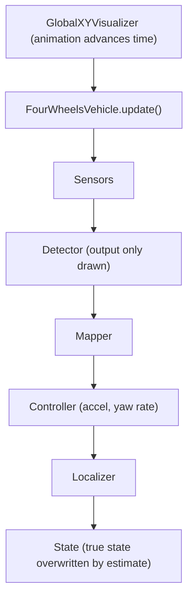
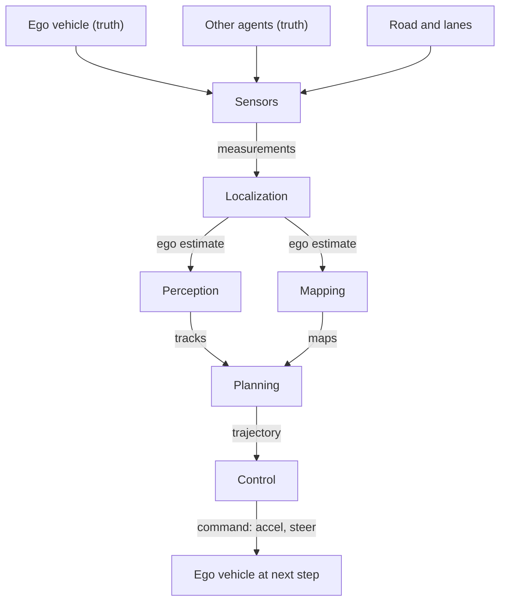
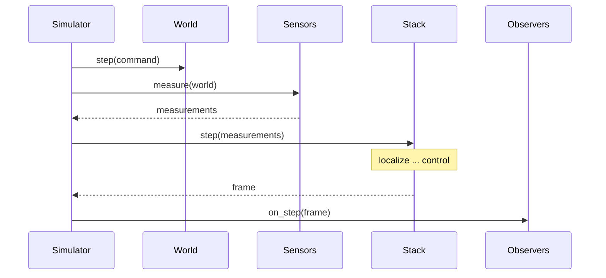
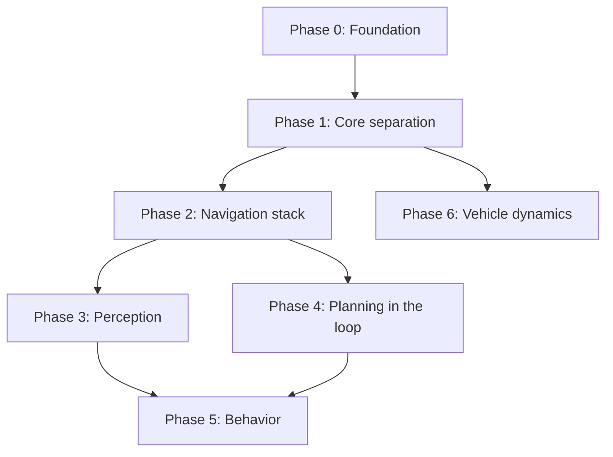

# Architecture and Roadmap

Status: **Proposal** (open for discussion)

This document describes the architecture this project is moving toward, and the order in which we plan to get there. It is meant for contributors and for anyone who wants to understand how the simulations are put together.

## Goal

Learners should be able to study **the whole navigation of an autonomous vehicle** through simulation: sensing, localization, perception, mapping, planning and control working together. They should be able to **swap algorithms and change parameters** at any stage (for example EKF → particle filter, Pure Pursuit → MPC, kinematic → dynamic vehicle model) and **compare the results** on the same scenario.

Today the project covers localization, sensing, global mapping, global path planning and a kinematic vehicle model, mostly as separate demos. Next, we want to add object tracking, local path planning, local mapping, obstacle avoidance, a dynamic vehicle model and lane changes.

## Design principles

1. **Readable first.** This is learning material. The flow "sense → estimate → perceive → plan → control → move" must be readable top to bottom in one short function, with no hidden framework.
2. **Small, explicit interfaces.** Each stage has a minimal interface (a few methods, documented with `typing.Protocol`). Any algorithm that implements it can be plugged in.
3. **Truth and estimate are separate.** The simulator owns the true state of the world. The autonomy stack only sees sensor measurements and its own estimates. This is what makes estimation errors visible and measurable.
4. **Simulation, autonomy and visualization are separate.** The simulator advances time, the stack decides, and the visualizer only observes. Simulations can then run without drawing (fast tests and comparisons).
5. **Units and frames are explicit.** Names carry units (`_m`, `_rad`, `_mps`), and data states which frame it is in (global, vehicle or sensor).

## Current architecture and its limits

Today, `FourWheelsVehicle` holds both the physical vehicle and the whole processing chain, and the animation advances time:



| Limit | Today | Blocks |
|---|---|---|
| Truth and estimate are mixed | With a localizer, `State.update_by_localizer()` overwrites the vehicle's state with the estimate, so the true pose is lost and the next GNSS measurement is generated from the estimate | Evaluating estimation, tracking, obstacle avoidance |
| The vehicle model is built into `State` | `State.motion_model` is a fixed kinematic model with acceleration and yaw rate as inputs | Dynamic vehicle model, steering-based control |
| Planning runs once, outside the loop | Planners write `path.json` before the simulation, which becomes a fixed spline course | Local planning, obstacle avoidance, lane change |
| No shared data between modules | Detector output is only drawn; the order of modules is fixed inside `FourWheelsVehicle` | Tracking, local mapping, avoidance |
| Drawing drives time | Time advances inside the animation; about 96% of runtime is spent recreating plot objects every frame | Fast runs, comparisons, sensor rates |
| No road or traffic model | A course is a single spline; obstacles move with constant acceleration and yaw rate | Lane change, tracking scenarios |

## Target architecture

The simulator owns the truth (top row). The navigation stack works only with measurements and estimates, and its command moves the ego vehicle in the next step, which closes the loop:



For readability the diagram shows only the main flow. Perception and mapping also use sensor data directly, and the ego estimate is available to every later stage. The visualizer and metrics observe both the world and the stack without changing them.

### Components

| Component | Responsibility | Interface (sketch) |
|---|---|---|
| `Simulator` | Advances time with a fixed `dt`, steps the world and the stack, notifies observers | `run(span_sec, observers)` |
| `World` | True state of everything: ego vehicle, other agents, road, static obstacles | `step(command, dt)` |
| `VehicleModel` | Vehicle motion, swappable (kinematic bicycle, dynamic bicycle, ...) | `step(state, command, dt) -> state` |
| `Command` | Actuator input from control | `accel_mps2`, `steer_rad` |
| `Sensor` | Generates measurements from the true world, with noise and its own rate | `measure(world, time_s) -> measurement` |
| `Localizer` | Estimates the ego pose from odometry and GNSS | `update(odometry, gnss, dt) -> PoseEstimate` |
| `Detector` | Finds objects in a point cloud | `detect(point_cloud, ego_estimate) -> detections` |
| `Tracker` | Associates detections over time and estimates object motion | `update(detections, dt) -> tracks` |
| `Mapper` | Builds a global or local (ego-centered, rolling) map | `update(point_cloud, ego_estimate) -> map` |
| `GlobalPlanner` | Plans a route on a map (A*, RRT*, ...) | `plan(map, start, goal) -> Path` |
| `BehaviorPlanner` | Decides what to do (keep lane, change lane, stop) | `decide(ego_estimate, tracks, route, road) -> Behavior` |
| `LocalPlanner` | Plans a short collision-free trajectory (VFH, DWA, Frenet, ...) | `plan(ego_estimate, behavior, route, local_map, tracks) -> Trajectory` |
| `Controller` | Tracks a trajectory | `update(ego_estimate, trajectory, dt) -> Command` |
| `Visualizer`, `Metrics` | Observe the world and the stack outputs; draw or record | `on_step(world, frame)` |

Key decisions:

- **`NavigationStack.step()`** is one short function that calls the stages in order and stores their outputs in a per-cycle `Frame` (a plain dataclass: measurements, ego estimate, detections, tracks, maps, trajectory, command). Learners read this one function to see the whole navigation flow; each stage can be replaced with one line.
- **`Trajectory` keeps the same methods as today's `CubicSplineCourse`** (nearest point, errors, curvature, target speed). Existing controllers can then follow a trajectory planned during the simulation without changes.
- **Stages are optional.** A demo of one algorithm (e.g. only NDT mapping) uses only the stages it needs, so today's single-algorithm demos keep working as "lessons".
- **One cycle** runs as follows. The simulator, not the animation, advances time:



  The world moves with the command from the previous cycle, the sensors measure the new truth, the stack fills a `Frame` from localization to control, and the observers draw or record it. This repeats every `dt`.
- **Truth vs estimate in drawings:** the vehicle is drawn at its true pose, estimates are drawn on top (e.g. covariance ellipses, estimated pose).

### How a learner uses it

```python
world = scenarios.two_lane_road_with_traffic()

stack = NavigationStack(
    localizer=ExtendedKalmanFilterLocalizer(...),   # try ParticleFilterLocalizer
    detector=LShapeFittingDetector(...),
    tracker=KalmanFilterTracker(...),
    behavior_planner=LaneChangeBehaviorPlanner(...),
    local_planner=FrenetPathPlanner(...),           # try a VFH-based planner
    controller=PurePursuitController(...),          # try MpcController
)

Simulator(world, stack, dt_s=0.1).run(span_sec=30, observers=[GlobalXYVisualizer(...)])
```

A comparison runner runs the same scenario with different stacks without drawing and reports metrics such as localization RMSE, lateral tracking error, minimum distance to obstacles, travel time and lateral acceleration.

### Decision: package structure

Scripts currently load modules with `sys.path.append(...)` (282 calls in 41 simulations). As modules start to depend on each other through shared interfaces, this gets harder to follow and risks silent name collisions. In Phase 1 we move to an installable package (`pip install -e .`, then `from <package>.control.pure_pursuit import PurePursuitController`). Until then, new code keeps following the current `sys.path.append(...)` convention.

## Roadmap

Each phase keeps existing simulations working. Phases are split into issues tracked in the roadmap issue. Phase 6 only needs the vehicle model interface from Phase 1, so it can run in parallel with Phases 2-5. Phase 7 continues alongside all phases.



| Phase | Content | Enables |
|---|---|---|
| **0. Foundation** (in progress) | Fix test/CI issues, faster drawing (persistent plot objects), separate showing and saving GIFs, deterministic tests, README and learning path | Fast feedback for the next phases |
| **1. Core separation** | Separate truth and estimate; `Command(accel, steer)` and swappable `VehicleModel` (move today's kinematic model into a kinematic bicycle model); odometry/IMU sensor as localization input; `Simulator` loop independent of drawing; interfaces as `Protocol`; installable package | Measurable estimation, vehicle model swapping, headless runs |
| **2. Navigation stack** | `NavigationStack` and `Frame`; port existing localizers, sensors, detectors, mappers and controllers to the stages; `Trajectory`; metrics and comparison runner; first end-to-end demo (global planning → localization → tracking control) | Swapping and comparing algorithms in one scenario |
| **3. Perception** | Object tracking (Kalman filter + data association), local rolling occupancy map, scenarios with moving agents | Seeing and predicting other objects |
| **4. Planning in the loop** | `LocalPlanner` with replanning; obstacle avoidance (VFH, DWA, Frenet); road and lane model | Local path planning, obstacle avoidance |
| **5. Behavior** | `BehaviorPlanner` (state machine); lane change on a multi-lane road with traffic | Lane change while driving |
| **6. Vehicle dynamics** (can start after Phase 1) | Dynamic bicycle model with a tire model; comparison with the kinematic model at higher speeds; controllers that use dynamics | Dynamic model |
| **7. Learning experience** (ongoing) | Lessons per stage linked from the learning path, design documents per stage, playground to select components and parameters | Learning by recombining |

### Ongoing contributions

- New single-algorithm demos are welcome at any time. They will be connected to the stack interfaces when the corresponding phase arrives.
- The VFH series (issue #52) fits Phase 4 as a local planner. Its steps are merged as standalone demos first, and adapted to the `LocalPlanner` interface in Phase 4.
